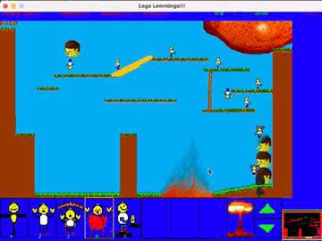

# Lego Lemmings
One of the worst things I've ever written in Java, for CS 2335 at Georgia Tech.

To build and run:

```
./build-and-run.sh
```

Originally this code was subdivided into packages and had an ant build, but all of that stuff is atrocious so I dropped it all.

<p align="center">
  
</p>

https://www.youtube.com/watch?v=Ff4fAtTphEE
https://www.youtube.com/watch?v=U5hQrTFqamo
